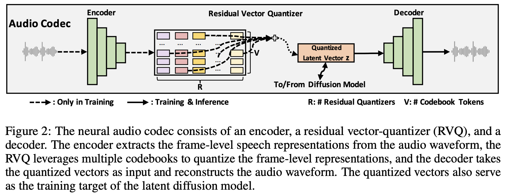

</img>

</img>

## Natural Speech 2 - Pytorch (wip)

Implementation of <a href="https://arxiv.org/abs/2304.09116">Natural Speech 2</a>, Zero-shot Speech and Singing Synthesizer, in Pytorch

NaturalSpeech 2 is a TTS system that leverages a neural audio codec with continuous latent vectors and a latent diffusion model with non-autoregressive generation to enable natural and zero-shot text-to-speech synthesis

This repository will use denoising diffusion rather than score-based SDE, and may potentially offer elucidated version as well. It will also offer improvements for the attention / transformer components wherever applicable.

## Appreciation

- <a href="https://stability.ai/">Stability</a> and <a href="https://huggingface.co/">🤗 Huggingface</a> for their generous sponsorships to work on and open source cutting edge artificial intelligence research

- <a href="https://huggingface.co/">🤗 Huggingface</a> for the amazing accelerate library

- <a href="https://github.com/manmay-nakhashi">Manmay</a> for submitting the initial code for phoneme, pitch, duration, and speech prompt encoders as well as the multilingual phonemizer and phoneme aligner!

- <a href="https://github.com/manmay-nakhashi">Manmay</a> for wiring up the complete end-to-end conditioning of the diffusion network!

- You? If you are an aspiring ML / AI engineer or work in the TTS field and would like to contribute to open sourcing state-of-the-art, jump right in!

## Install

```bash
$ pip install naturalspeech2-pytorch
```

## Usage

```python
import torch
from naturalspeech2_pytorch import (
    EncodecWrapper,
    Model,
    NaturalSpeech2
)

# use encodec as an example

codec = EncodecWrapper()

model = Model(
    dim = 128,
    depth = 6
)

# natural speech diffusion model

diffusion = NaturalSpeech2(
    model = model,
    codec = codec,
    timesteps = 1000
).cuda()

# mock raw audio data

raw_audio = torch.randn(4, 327680).cuda()

loss = diffusion(raw_audio)
loss.backward()

# do the above in a loop for a lot of raw audio data...
# then you can sample from your generative model as so

generated_audio = diffusion.sample(length = 1024) # (1, 327680)

```

With conditioning

ex.

```python
import torch
from naturalspeech2_pytorch import (
    EncodecWrapper,
    Model,
    NaturalSpeech2,
    SpeechPromptEncoder
)

# use encodec as an example

codec = EncodecWrapper()

model = Model(
    dim = 128,
    depth = 6,
    dim_prompt = 512,
    cond_drop_prob = 0.25,                  # dropout prompt conditioning with this probability, for classifier free guidance
    condition_on_prompt = True
)

# natural speech diffusion model

diffusion = NaturalSpeech2(
    model = model,
    codec = codec,
    timesteps = 1000
)

# mock raw audio data

raw_audio = torch.randn(4, 327680)
prompt = torch.randn(4, 32768)               # they randomly excised a range on the audio for the prompt during training, eventually will take care of this auto-magically

text = torch.randint(0, 100, (4, 100))
text_lens = torch.tensor([100, 50 , 80, 100])

# forwards and backwards

loss = diffusion(
    audio = raw_audio,
    text = text,
    text_lens = text_lens,
    prompt = prompt
)

loss.backward()

# after much training

generated_audio = diffusion.sample(
    length = 1024,
    text = text,
    prompt = prompt
) # (1, 327680)
```

Or if you want a `Trainer` class to take care of the training and sampling loop, just simply do

```python
from naturalspeech2_pytorch import Trainer

trainer = Trainer(
    diffusion_model = diffusion,     # diffusion model + codec from above
    folder = '/path/to/speech',
    train_batch_size = 16,
    gradient_accumulate_every = 2,
)

trainer.train()
```

## Todo

- [x] complete perceiver then cross attention conditioning on ddpm side
- [x] add classifier free guidance, even if not in paper
- [x] complete duration / pitch prediction during training - thanks to Manmay
- [x] make sure pyworld way of computing pitch can also work

- [ ] consult phd student in TTS field about pyworld usage
- [ ] also offer direct summation conditioning using spear-tts text-to-semantic module, if available
- [ ] add self-conditioning on ddpm side
- [ ] take care of automatic slicing of audio for prompt, being aware of minimal audio segment as allowed by the codec model
- [ ] make sure curtail_from_left works for encodec, figure out what they are doing

## Citations

```bibtex
@inproceedings{Shen2023NaturalSpeech2L,
    title   = {NaturalSpeech 2: Latent Diffusion Models are Natural and Zero-Shot Speech and Singing Synthesizers},
    author  = {Kai Shen and Zeqian Ju and Xu Tan and Yanqing Liu and Yichong Leng and Lei He and Tao Qin and Sheng Zhao and Jiang Bian},
    year    = {2023}
}
```

```bibtex
@misc{shazeer2020glu,
    title   = {GLU Variants Improve Transformer},
    author  = {Noam Shazeer},
    year    = {2020},
    url     = {https://arxiv.org/abs/2002.05202}
}
```

```bibtex
@inproceedings{dao2022flashattention,
    title   = {Flash{A}ttention: Fast and Memory-Efficient Exact Attention with {IO}-Awareness},
    author  = {Dao, Tri and Fu, Daniel Y. and Ermon, Stefano and Rudra, Atri and R{\'e}, Christopher},
    booktitle = {Advances in Neural Information Processing Systems},
    year    = {2022}
}
```

```bibtex
@article{Salimans2022ProgressiveDF,
    title   = {Progressive Distillation for Fast Sampling of Diffusion Models},
    author  = {Tim Salimans and Jonathan Ho},
    journal = {ArXiv},
    year    = {2022},
    volume  = {abs/2202.00512}
}
```

```bibtex
@inproceedings{Hang2023EfficientDT,
    title   = {Efficient Diffusion Training via Min-SNR Weighting Strategy},
    author  = {Tiankai Hang and Shuyang Gu and Chen Li and Jianmin Bao and Dong Chen and Han Hu and Xin Geng and Baining Guo},
    year    = {2023}
}
```

```bibtex
@article{Alayrac2022FlamingoAV,
    title   = {Flamingo: a Visual Language Model for Few-Shot Learning},
    author  = {Jean-Baptiste Alayrac and Jeff Donahue and Pauline Luc and Antoine Miech and Iain Barr and Yana Hasson and Karel Lenc and Arthur Mensch and Katie Millican and Malcolm Reynolds and Roman Ring and Eliza Rutherford and Serkan Cabi and Tengda Han and Zhitao Gong and Sina Samangooei and Marianne Monteiro and Jacob Menick and Sebastian Borgeaud and Andy Brock and Aida Nematzadeh and Sahand Sharifzadeh and Mikolaj Binkowski and Ricardo Barreira and Oriol Vinyals and Andrew Zisserman and Karen Simonyan},
    journal  = {ArXiv},
    year     = {2022},
    volume   = {abs/2204.14198}
}
```

```bibtex
@article{Badlani2021OneTA,
    title   = {One TTS Alignment to Rule Them All},
    author  = {Rohan Badlani and Adrian Lancucki and Kevin J. Shih and Rafael Valle and Wei Ping and Bryan Catanzaro},
    journal = {ICASSP 2022 - 2022 IEEE International Conference on Acoustics, Speech and Signal Processing (ICASSP)},
    year    = {2021},
    pages   = {6092-6096},
    url     = {https://api.semanticscholar.org/CorpusID:237277973}
}
```
